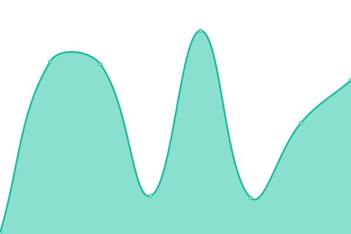

# [📈 Live Status](https://status.fyle.uk): <!--live status--> **🟧 Partial outage**

This repository contains the open-source uptime monitor and status page for [stringsplit](https://status.fyle.uk), powered by [Upptime](https://github.com/upptime/upptime).

With [Upptime](https://upptime.js.org), you can get your own unlimited and free uptime monitor and status page, powered entirely by a GitHub repository. We use [Issues](https://github.com/nbitzz/status/issues) as incident reports, [Actions](https://github.com/nbitzz/status/actions) as uptime monitors, and [Pages](https://status.fyle.uk) for the status page.

<!--start: status pages-->
<!-- This summary is generated by Upptime (https://github.com/upptime/upptime) -->
<!-- Do not edit this manually, your changes will be overwritten -->
<!-- prettier-ignore -->
| URL | Status | History | Response Time | Uptime |
| --- | ------ | ------- | ------------- | ------ |
|  [Site](https://fyle.uk) | 🟥 Down | [site.yml](https://github.com/nbitzz/status/commits/HEAD/history/site.yml) | 

 0ms
     
 | 

<a href="https://status.fyle.uk/history/site">0.00%</a>
    

|  [File access](https://fyle.uk/file/fish) | 🟥 Down | [file-access.yml](https://github.com/nbitzz/status/commits/HEAD/history/file-access.yml) | 

 0ms
     
 | 

<a href="https://status.fyle.uk/history/file-access">0.00%</a>
    

|  [coolviruses.download Firefish](https://coolviruses.download/) | 🟩 Up | [coolviruses-download-firefish.yml](https://github.com/nbitzz/status/commits/HEAD/history/coolviruses-download-firefish.yml) | 

 463ms
     
 | 

<a href="https://status.fyle.uk/history/coolviruses-download-firefish">100.00%</a>
    

|  [fedi.fnaf.stream](https://helloeverybodymynameismarkiplierandwelcometofivenightsatfreddys.anindiehorrorgamethatyouguyssuggestedenmasseandisawthatyamimash.playeditandhesaidthatitwasreallyreallygoodsoimveryeagertoseewha.tisupandthatisaterrifyinganimatronicbear.fnaf.stream/) | 🟥 Down | [fedi-fnaf-stream.yml](https://github.com/nbitzz/status/commits/HEAD/history/fedi-fnaf-stream.yml) | 

 436ms
     
 | 

<a href="https://status.fyle.uk/history/fedi-fnaf-stream">100.00%</a>
    

|  [Sshwifty](https://ssh.fyle.uk/) | 🟥 Down | [sshwifty.yml](https://github.com/nbitzz/status/commits/HEAD/history/sshwifty.yml) | 

 0ms
     
 | 

<a href="https://status.fyle.uk/history/sshwifty">0.00%</a>
    

|  [Bore](tunnel.fyle.uk) | 🟩 Up | [bore.yml](https://github.com/nbitzz/status/commits/HEAD/history/bore.yml) | 

 38ms
     
 | 

<a href="https://status.fyle.uk/history/bore">100.00%</a>
    

|  [Jellyfin](https://jelly.fyle.uk/) | 🟩 Up | [jellyfin.yml](https://github.com/nbitzz/status/commits/HEAD/history/jellyfin.yml) | 

 413ms
     
 | 

<a href="https://status.fyle.uk/history/jellyfin">100.00%</a>
    

|  [Authentik](https://id.split.pet/) | 🟩 Up | [authentik.yml](https://github.com/nbitzz/status/commits/HEAD/history/authentik.yml) | 

 1001ms
     
 | 

<a href="https://status.fyle.uk/history/authentik">100.00%</a>
    

|  [Vaultwarden](https://vault.split.pet/) | 🟩 Up | [vaultwarden.yml](https://github.com/nbitzz/status/commits/HEAD/history/vaultwarden.yml) | 

 416ms
     
 | 

<a href="https://status.fyle.uk/history/vaultwarden">100.00%</a>
    

|  [Forgejo](https://git.sucks.win/) | 🟥 Down | [forgejo.yml](https://github.com/nbitzz/status/commits/HEAD/history/forgejo.yml) | 

 341ms
     
 | 

<a href="https://status.fyle.uk/history/forgejo">0.00%</a>
    

<!--end: status pages-->

[**Visit our status website →**](https://status.fyle.uk)

## 📄 License

- Powered by: [Upptime](https://github.com/upptime/upptime)
- Code: [MIT](./LICENSE) © [stringsplit](https://status.fyle.uk)
- Data in the `./history` directory: [Open Database License](https://opendatacommons.org/licenses/odbl/1-0/)
