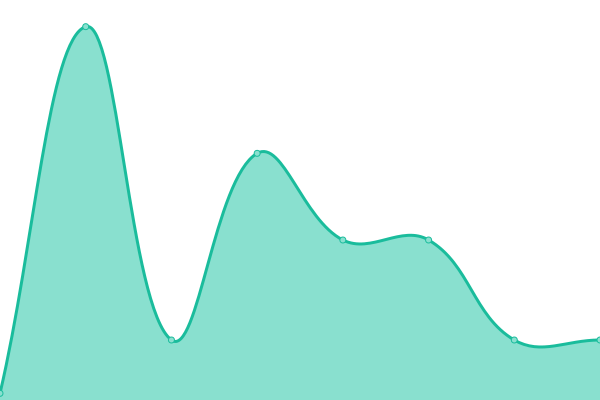

# [📈 Live Status](https://status.fyle.uk): <!--live status--> **🟧 Partial outage**

This repository contains the open-source uptime monitor and status page for [stringsplit](https://status.fyle.uk), powered by [Upptime](https://github.com/upptime/upptime).

With [Upptime](https://upptime.js.org), you can get your own unlimited and free uptime monitor and status page, powered entirely by a GitHub repository. We use [Issues](https://github.com/nbitzz/status/issues) as incident reports, [Actions](https://github.com/nbitzz/status/actions) as uptime monitors, and [Pages](https://status.fyle.uk) for the status page.

<!--start: status pages-->
<!-- This summary is generated by Upptime (https://github.com/upptime/upptime) -->
<!-- Do not edit this manually, your changes will be overwritten -->
<!-- prettier-ignore -->
| URL | Status | History | Response Time | Uptime |
| --- | ------ | ------- | ------------- | ------ |
|  [Site](https://fyle.uk) | 🟩 Up | [site.yml](https://github.com/nbitzz/status/commits/HEAD/history/site.yml) | 

 2674ms
     
 | 

<a href="https://status.fyle.uk/history/site">99.83%</a>
    

|  [Basic API](https://fyle.uk/server) | 🟩 Up | [basic-api.yml](https://github.com/nbitzz/status/commits/HEAD/history/basic-api.yml) | 

 123ms
     
 | 

<a href="https://status.fyle.uk/history/basic-api">99.66%</a>
    

|  [File access](https://fyle.uk/file/fish) | 🟩 Up | [file-access.yml](https://github.com/nbitzz/status/commits/HEAD/history/file-access.yml) | 

 1845ms
     
 | 

<a href="https://status.fyle.uk/history/file-access">99.32%</a>
    

|  [Site (beta)](https://beta.fyle.uk) | 🟩 Up | [site-beta.yml](https://github.com/nbitzz/status/commits/HEAD/history/site-beta.yml) | 

 442ms
     
 | 

<a href="https://status.fyle.uk/history/site-beta">100.00%</a>
    

|  [File access (beta)](https://beta.fyle.uk/file/fish) | 🟩 Up | [file-access-beta.yml](https://github.com/nbitzz/status/commits/HEAD/history/file-access-beta.yml) | 

 1809ms
     
 | 

<a href="https://status.fyle.uk/history/file-access-beta">100.00%</a>
    

|  [Mastodon server](https://so.fyle.uk/) | 🟥 Down | [mastodon-server.yml](https://github.com/nbitzz/status/commits/HEAD/history/mastodon-server.yml) | 

 0ms
     
 | 

<a href="https://status.fyle.uk/history/mastodon-server">0.00%</a>
    

|  [Sshwifty](https://ssh.fyle.uk/) | 🟩 Up | [sshwifty.yml](https://github.com/nbitzz/status/commits/HEAD/history/sshwifty.yml) | 

 148ms
     
 | 

<a href="https://status.fyle.uk/history/sshwifty">99.83%</a>
    

|  [Bore](tunnel.fyle.uk) | 🟩 Up | [bore.yml](https://github.com/nbitzz/status/commits/HEAD/history/bore.yml) | 

 56ms
     
 | 

<a href="https://status.fyle.uk/history/bore">100.00%</a>
    

|  [theUnfunny](https://unfunny.glitch.me/) | 🟩 Up | [the-unfunny.yml](https://github.com/nbitzz/status/commits/HEAD/history/the-unfunny.yml) | 

 328ms
     
 | 

<a href="https://status.fyle.uk/history/the-unfunny">100.00%</a>
    

<!--end: status pages-->

[**Visit our status website →**](https://status.fyle.uk)

## 📄 License

- Powered by: [Upptime](https://github.com/upptime/upptime)
- Code: [MIT](./LICENSE) © [stringsplit](https://status.fyle.uk)
- Data in the `./history` directory: [Open Database License](https://opendatacommons.org/licenses/odbl/1-0/)
